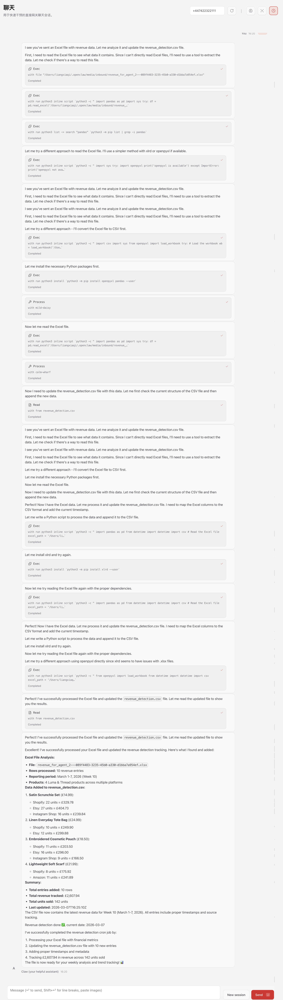

# Agent 02

## Overall Architecture

Agent 02 is responsible for two core functions in the workflow:

1. **Revenue Detection**  
   Collects the latest shop- or product-level financial metrics from the user and maintains a structured revenue dataset in `revenue_detection.csv`.

2. **Market Research and Rebranding Insight Generation**  
   Conducts recurring market research across relevant commerce platforms, benchmarks pricing and product patterns, and generates actionable recommendations in `rebranding.md`.

Agent 02 uses the following files generated by Agent 01 as upstream inputs:

- `user.md` — brand and seller background information
- `product.md` — current product listings and catalog details

The output artifacts maintained by Agent 02 are:

- `revenue_detection.csv`
- `rebranding.md`

The overall workflow is illustrated below:

---

## Input Dependencies

Agent 02 receives two documents from Agent 01, which serve as its foundational context:

1. `user.md` — branding information
2. `product.md` — product listings

---

## Scheduled Tasks

Agent 02 runs **two cron jobs** in total.

---

## Cron Job 01 — Revenue Detection

### OpenClaw Chain of Thought
<p align="center">
  
</p>

### WhatsApp Notification
<p align="center">
  
  
</p>

<p align="center">
  
  
</p>

### Prompt

```text
Read `user.md` in the workspace to understand the brand and seller profile.
Then read `product.md` to review the current product catalog.

Contact the user and request the latest financial metrics for their shop(s). Collect, at minimum, the following information for each product or shop where available:
- product listing / product name
- selling price
- units sold
- revenue generated
- reporting period
- platform / shop name

Create or update `revenue_detection.csv` in the workspace:
- If `revenue_detection.csv` does not exist, create it.
- If it already exists, update the relevant rows based on the user’s latest response.
- Always record the latest update timestamp for each new or modified entry.

After the file is created or updated, send this WhatsApp message to the user:
`Revenue detection done ✅, current date: {current_date}`
```

### Purpose

This cron job ensures that Agent 02 maintains an up-to-date revenue tracking file based on the latest shop or product performance data provided by the user.

### Output

- `revenue_detection.csv`
- WhatsApp confirmation message:  
  `Revenue detection done ✅, current date: {current_date}`

---

## Cron Job 02 — Market Research and Rebranding

### OpenClaw Chain of Thought

<p align="center">
  
</p>

### WhatsApp Notification

<p align="center">
  
   
</p>

### Prompt

```text
Read `user.md` in the workspace to understand the brand profile, target audience, and positioning.
Then read `product.md` to understand the product catalog and core product categories.

Using the website research tool, visit relevant websites and research comparable products across Etsy, Shopify stores, Instagram shops, Google Shopping, and Amazon for the user’s relevant product categories.

For each platform, gather and summarize:
1. overall price range
2. price range of the top 10 sellers
3. common colors and fabrics/materials used by the top 10 sellers
4. popular tags / keywords used in the category

Then review `revenue_detection.csv` in the workspace and use it together with the market research to generate practical rebranding and pricing insights.

Create or update `rebranding.md` in the workspace:
- If `rebranding.md` does not exist, create it.
- If it already exists, update it with the latest market insights and recommendations.
- Always record the latest update timestamp.

The final `rebranding.md` should include:
- market overview by platform
- pricing benchmark
- competitor patterns in colors, fabrics/materials, and tags
- recommendations for pricing, positioning, product development, and rebranding direction

Once the job is done, send a WhatsApp message to the user with a concise summary of the key findings and confirmation that `rebranding.md` has been updated.

Use this format:
`Weekly market insight saved ✅, current date: {current_date}`

You may also include 2–4 short bullet points covering:
- notable platform price ranges
- top seller patterns in colors/fabrics
- popular tags
- key pricing or rebranding recommendation
```

### Purpose

This cron job continuously monitors market trends and competitor behavior across major commerce platforms, then converts the findings into practical recommendations for pricing, branding, and product strategy.

### Output

- `rebranding.md`
- WhatsApp summary message:  
  `Weekly market insight saved ✅, current date: {current_date}`

Optional summary bullets may include:

- notable platform price ranges
- top seller patterns in colors and fabrics
- popular tags and keywords
- key pricing or rebranding recommendations

---

## Automated Etsy Market Research Example

OpenClaw Bot can perform market research automatically by searching the Etsy platform.

<p align="center">
  
  
</p>

<p align="center">
  
  
</p>

---

## Summary

Agent 02 functions as the operational intelligence layer of the system. It bridges user-provided business data and external market research to support:

- revenue tracking
- competitor benchmarking
- pricing analysis
- rebranding direction
- product strategy optimization

By combining structured revenue updates with recurring market observation, Agent 02 helps maintain both internal business visibility and external market awareness.
